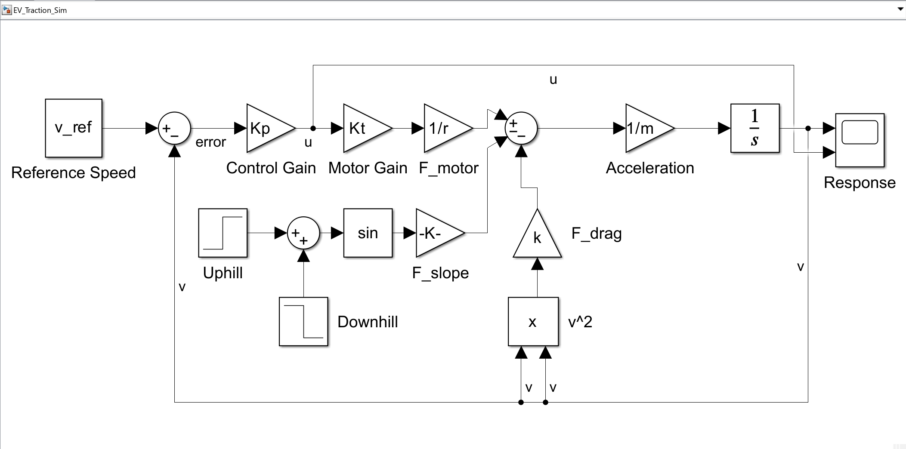
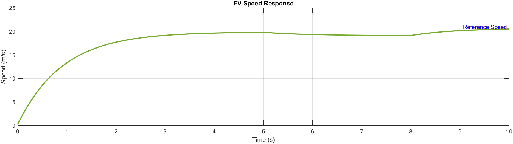
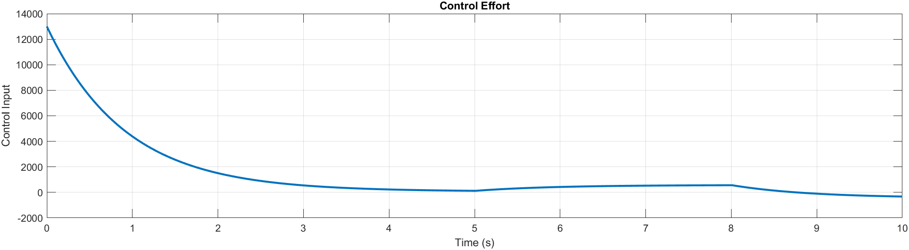
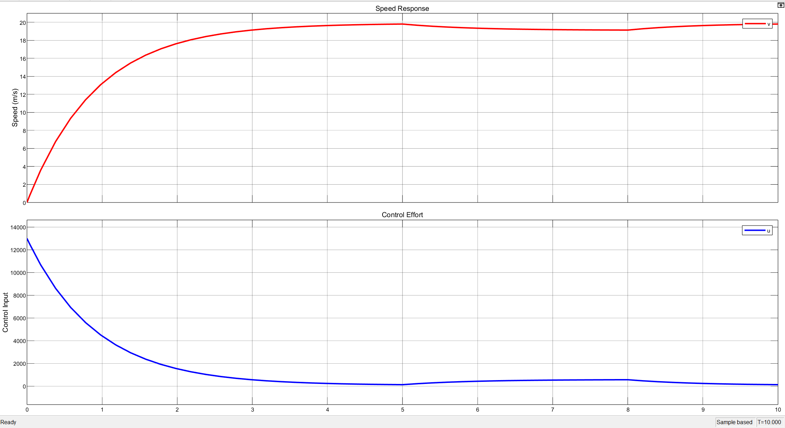

# Electric Vehicle Traction Control System Simulation

## Overview
This project presents a physics-based simulation of an electric vehicle traction control system developed using MATLAB and Simulink. The objective is to model how an EV regulates its speed under changing road conditions using closed-loop control.

The system includes vehicle longitudinal dynamics, motor-generated traction force, aerodynamic drag, and road slope disturbance. A proportional controller is used to track a desired reference speed and maintain stable operation during flat, uphill, and downhill driving conditions.

This project demonstrates core concepts from control systems, vehicle dynamics, and simulation-based engineering.

---

## Objectives
- Model the longitudinal motion of an electric vehicle
- Implement closed-loop speed control
- Simulate the effect of road slope disturbances
- Analyze control effort during acceleration and disturbance rejection
- Compare script-based MATLAB simulation with block-based Simulink implementation

---

## Tools Used
- MATLAB
- Simulink

---

## Project Files
- `README.md`
- `control_effort.png` | control effort plot
- `ev_traction_simulation.m` | MATLAB script for numerical simulation
- `ev_traction_simulink_model.slx` | Simulink model of the EV traction system
- `simulink_model.png` | Simulink block diagram
- `speed_control_response.png` | combined response plot
- `speed_response.png` | speed response plot
---

## System Description
The EV traction model is based on longitudinal vehicle dynamics. The motor generates driving force, while aerodynamic drag and road slope act as opposing disturbances.

The controller computes the control input from the difference between desired speed and actual speed:

u = Kp * (v_ref - v)

Motor torque and traction force are then generated as:

T = Kt * u  
F_motor = T / r  

The net vehicle acceleration is governed by:

m * dv/dt = F_motor - F_drag - F_slope  

where:

F_drag = k * v^2  
F_slope = m * g * sin(theta)

---

## Simulink Model
The block diagram below represents the EV traction control system implemented in Simulink.

The model includes:
- reference speed input
- error computation
- proportional controller
- motor gain block
- traction force generation
- drag force modeling
- slope disturbance modeling
- acceleration and speed integration
- feedback loop for closed-loop control

---

## Simulation Scenario
The simulation runs for 10 seconds with a reference speed of 20 m/s.

Road profile:
- **0 to 5 s:** flat road
- **5 to 8 s:** uphill section
- **8 to 10 s:** downhill section

This setup allows the controller response to be evaluated under changing operating conditions.

---

## Results

### Speed Response

The vehicle speed rises smoothly from rest and approaches the reference speed with stable behavior. When the road becomes uphill, the speed drops slightly due to increased load. During the downhill interval, the vehicle recovers and returns close to the reference speed.

### Control Effort

The control effort is highest at startup because the controller must accelerate the vehicle from rest. As the speed approaches the setpoint, the required control input decreases significantly. Disturbances introduced by slope changes cause the controller to adjust its effort accordingly.

### Combined Response

The combined response gives a clear view of the relationship between vehicle speed and control input throughout the simulation.

---

## Key Engineering Takeaways
- Closed-loop control improves speed regulation under varying road conditions
- Vehicle drag increases with speed and affects steady-state behavior
- Road slope acts as a realistic external disturbance
- MATLAB and Simulink together provide a useful workflow for analysis and system-level modeling
- Even a simple proportional controller can provide acceptable tracking for a basic EV traction model

---

## Possible Improvements
This project can be extended further by adding:
- PI or PID control
- actuator saturation
- battery model
- inverter and PWM drive stage
- regenerative braking
- BLDC or PMSM motor model
- state-space or modern control design

---

## Author
Abhishek Deshmukh  
